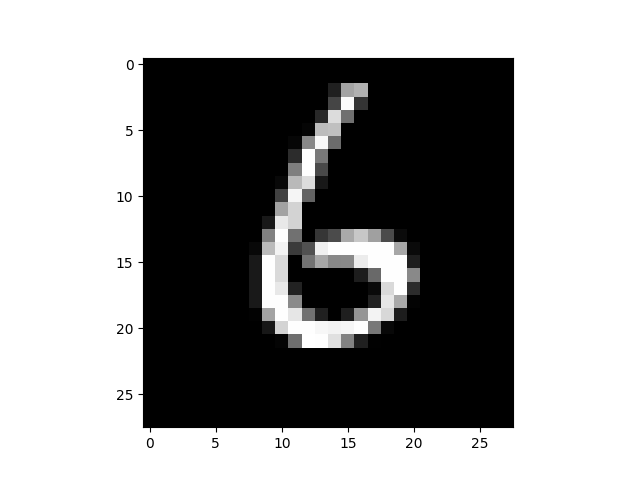
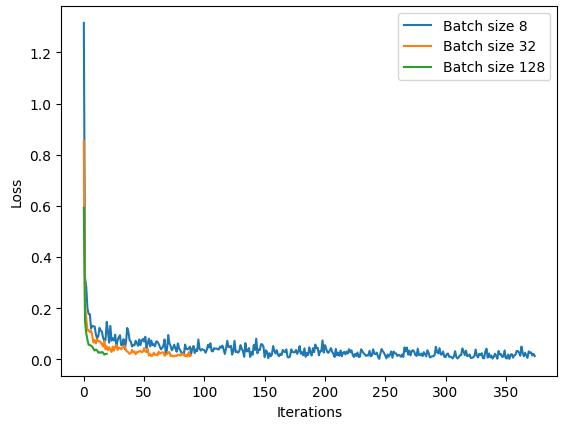

# Simple CNN using PyTorch

This repository contains a simple implementation of a Convolutional Neural Network (CNN) using PyTorch. The CNN is trained on the MNIST dataset, a collection of 28x28 grayscale images of handwritten digits (0-9).

## Project Structure

```
.
├── data
├── images
│   ├── batch_sizes_8_32_128.jpg
│   └── mnist_sample.png
├── notebooks
│   └── traditional_cnn_notebook.ipynb
├── .gitignore
├── README.md
└── requirements.txt
```
## Setup:

1\. Clone the repository:

```bash
git clone https://github.com/AbdallahAbou/Traditional_Convolutional_Neural_Network
```

2\. Navigate to the project directory:

```bash
cd Traditional_Convolutional_Neural_Network
```

3\. Install dependencies:

```bash
pip install -r requirements.txt
```
## Introduction to CNNs

A Convolutional Neural Network (CNN) is a type of deep neural network commonly used for analyzing visual data. It consists of several layers, including convolutional layers, pooling layers, and fully connected layers.

### Key Components of CNNs

1. **Convolutional Layer (Conv Layer):** Applies filters to the input image to detect features.
2. **Activation Function (ReLU):** Introduces non-linearity to the model.
3. **Pooling Layer (Max Pooling):** Reduces the spatial dimensions of the input volume.
4. **Fully Connected Layer (FC Layer):** Connects every neuron in one layer to every neuron in another layer.

## Step-by-Step Implementation

### Step 1: Importing Libraries

```python
import torch
import torch.nn as nn
import torch.optim as optim
import torchvision
import torchvision.transforms as transforms
import matplotlib.pyplot as plt
```

### Step 2: Loading and Preprocessing Data

We use the MNIST dataset and apply transformations to convert images to PyTorch tensors and normalize them.

Here is a sample image from the MNIST dataset:



Each image comes with a label that will be used for training. 

### Step 3: Defining the CNN Model, Training and Evaluating

We define a simple CNN with two convolutional layers and two fully connected layers, train the model, and then evaluate it on the test data.

## Understanding Batch Size

Batch size is an important hyperparameter that determines the number of samples processed before the model's internal parameters are updated.
Effects of Batch Size:

- Smaller Batch Sizes:
    Pros: More frequent updates, less memory usage.
    Cons: Noisier updates, longer training time.

- Larger Batch Sizes:
    Pros: Smoother updates, faster training per epoch.
    Cons: More memory usage, less frequent updates.

Example:

We trained the model with different batch sizes (8, 32, 128) and observed the effects on the loss function. The plot below shows the training loss for different batch sizes:

Batch Size 128: Converges quickly and smoothly.
Batch Size 32: Shows good convergence but takes slightly more iterations.
Batch Size 8: Converges more slowly with more fluctuations in the loss values.




## Conclusion

This guide provides a step-by-step approach to implementing a simple CNN using PyTorch, understanding the effects of batch size, and interpreting the results. Experimenting with different batch sizes can help you find the optimal balance for your specific problem and hardware constraints.

Feel free to experiment with the code and modify it to improve your understanding and the model's performance.

## Contributing:

Contributions are welcome! Please submit a pull request or open an issue to discuss any changes.

## License:
    
This project is licensed under the MIT License - see the LICENSE file for details.